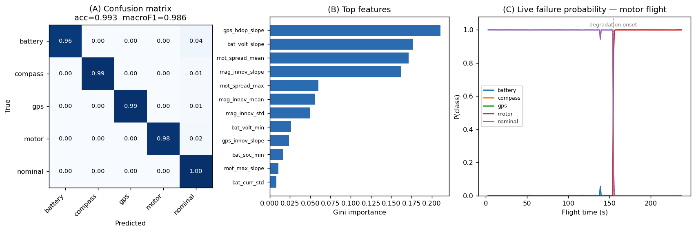

# UAV Predictive Failure Detection and Response System

A closed-loop predictive maintenance system for fixed-wing / VTOL UAVs. It reads
flight telemetry (replayed, simulated, or live over MAVLink), detects single and
**simultaneous** component faults during their early onset, and gives a ground
operator ranked, safety-aware recovery actions with a 5-second auto-default. In
live mode it sends the chosen action back to the vehicle as a real MAVLink
command.

The whole pipeline is schema-compatible with ArduPilot DataFlash / MAVLink, so a
synthetic generator, ArduPilot SITL, and a real flight controller all feed the
same code unchanged.

## The four stages

1. **Sense** — telemetry from a CSV, SITL, or a real FC over MAVLink.
2. **Detect** — a multi-label model flags which faults are developing, several at
   once if needed, before hard cutoff.
3. **Decide** — a deterministic safety policy maps active faults to ranked actions,
   hiding options that are unsafe for the current fault (RTL needs GPS and compass,
   so it is removed on those faults).
4. **Act** — the operator hub shows the alarm and a countdown; the operator picks
   an action or the safe default auto-fires. Live mode sends a real mode command.

## Results

Multi-label detector, held-out **flights** (no leakage), noisy multi-fault data:

| Fault | Precision | Recall | F1 |
|---|---|---|---|
| Battery | 0.98 | 0.96 | 0.97 |
| GPS | 0.99 | 0.99 | 0.99 |
| Compass | 0.98 | 0.99 | 0.99 |
| Motor | 0.99 | 0.98 | 0.99 |

Temporal smoothing (confirm after 3 consecutive windows) cut false-positive
windows by ~91% (90 → 8). Mean early-warning margin on synthetic flights was
~94 s before cutoff. Top features are physically interpretable: GPS HDOP slope,
battery voltage slope, motor-output spread, magnetometer innovation slope.



> Honesty note: synthetic flights are cleaner and more separable than real logs,
> so these numbers will drop on real data. The value is the architecture, the
> early-warning margin, and the noise/false-alarm handling, not the headline
> accuracy. Recalibrate on real flight logs before drawing conclusions.

## Architecture

```
  CSV replay ┐                         ┌─ windowing → 53 features → multi-label
  SITL       ├─ MAVLink or CSV ──────► │  model → per-fault probabilities →
  real FC    ┘                         │  temporal smoothing → decision policy
                                       └──────────────┬──────────────────────
                                                      │ decision stream
                                                      ▼
                                        operator hub (faults + ranked actions
                                        + 5s countdown + auto-default)
                                                      │ chosen action
                                                      ▼
                              command out: MAVLink set_mode → vehicle  [live only]
```

Two paths, identical downstream. **Replay**: a CSV is scored and the hub replays
the decision timeline (commands logged only). **Live**: the server holds an open
MAVLink link, runs the model per incoming window, streams decisions, and sends
commands back. Live is the only path that closes the loop.

## Quickstart

```bash
pip install -r requirements.txt

# generate training data and train the multi-label detector
python sim/generate_multifault.py --flights 120 --out data/multi
python ml/train_multi.py

# start the operator hub backend, then open http://localhost:8000
python dashboard/server.py
```

In the hub, pick any flight from the dropdown and press Load, or pick
**MAVLink [LIVE]** to connect to a live feed.

### Live demo without ArduPilot (fake MAVLink feed)

```bash
# terminal 1: stream a recorded flight as live MAVLink telemetry
python sim/fake_mavlink_feed.py --flight data/raw/STRESS_multi.csv --loop --speed 5
# terminal 2
python dashboard/server.py
# open http://localhost:8000, pick MAVLink [LIVE], Load
```

This demonstrates live detection. It cannot execute commands, because a recording
is not a flight stack. For a real closed loop, use SITL or a real drone.

### Live with ArduPilot SITL

```bash
sim_vehicle.py -v ArduPlane -f quadplane --console
python dashboard/server.py
# open http://localhost:8000, pick MAVLink [LIVE], Load
# inject faults in the SITL console with SIM_ parameters
```

## Faults modelled

| Mode | Signature the model keys on |
|---|---|
| Battery | accelerating voltage collapse, rising draw under load |
| GPS | satellite dropout, HDOP climb, EKF position innovation rise |
| Compass | magnetometer field drift, EKF mag innovation, yaw drift |
| Motor | one motor PWM saturating toward max, attitude-error and vibration rise |

## Repo layout

```
sim/        synthetic generators (single-fault, multi-fault, stress) + fake MAVLink feed
logger/     pymavlink logger for capturing live SITL / real flights to CSV
ml/         features, training (single + multi-label), policy, stream core, reporting
dashboard/  operator hub (standalone + server-driven) and the backend server
data/       generated / logged flight CSVs
models/     trained models + metrics
reports/    figures + lead-time table
docs/       full system documentation (SYSTEM_DOCUMENTATION.md)
```

Start with `docs/SYSTEM_DOCUMENTATION.md` for the in-depth reference, including
the step-by-step path to connecting a real drone.

## What works today

- Detect single and simultaneous faults from telemetry.
- Tolerate noisy telemetry (training noise + temporal smoothing).
- Replay any logged flight with the full decision timeline.
- Connect to a live MAVLink feed and detect faults in real time.
- Present ranked, safety-aware actions with a 5-second auto-default.
- Send a real MAVLink mode command to a connected vehicle.

## Limitations and what is not done

- It detects fault onset; it cannot foresee a fault from a perfectly healthy reading.
- Command-out sends a real command but does **not** yet read COMMAND_ACK to
  confirm execution, and has no pre-arm / failsafe / RC-override checks. Not safe
  for real hardware until those are added (see docs section 8).
- Detection numbers are from synthetic data; recalibrate on real logs.
- Actions for concurrent faults use highest-severity selection, not joint optimisation.

## Roadmap to a real drone

Summarised here, detailed in `docs/SYSTEM_DOCUMENTATION.md` section 8:

1. Acknowledge-confirm commands (verify the mode actually changed, retry on failure).
2. Pre-send checks (armed, GPS fix, mode available, no active failsafe).
3. Resend on lossy links; failsafe and RC-override awareness.
4. Validate in SITL → bench with props off → supervised hover → missions.
5. Retrain and recalibrate thresholds on real flight logs.

## License

MIT. See `LICENSE`.
